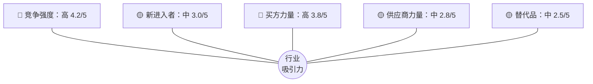
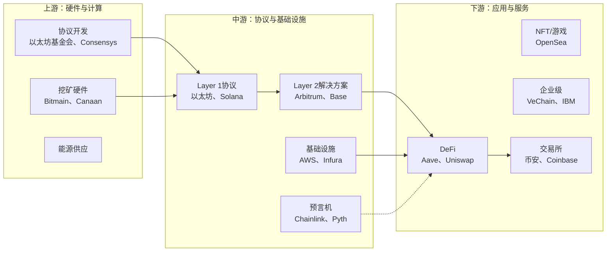
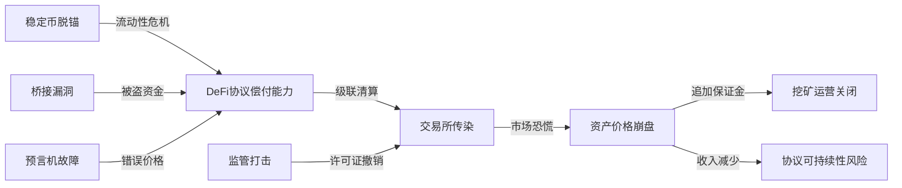

# 区块链技术（全球）——综合行业分析

**多源合成** | 最后更新：2026-02-25

---

## 1. 执行摘要

### 1.1 摘要

全球区块链技术行业已进入决定性的成熟阶段，正从投机起源转向受监管的、机构级基础设施。该市场在2024-2025年估值约为310-410亿美元，预计到2030-2032年达到1190-3930亿美元，并可能在2035年超过1.8万亿美元，复合年增长率为37-64%。

催化剂包括欧盟全面执行的MiCA法规、美国稳定币GENIUS法案、现货比特币/以太坊ETF批准，以及现实世界资产（RWA）代币化的爆炸式增长——到2025年中期链上规模达到240亿美元。战略价值正在中游基础设施（Layer-1/Layer-2协议）整合，毛利率超过80%，而下游应用仍然分散。AI代理与区块链的融合、模块化架构和零知识证明扩展代表了下一个技术前沿。

### 1.2 关键发现

| 维度 | 评估 | 置信度 |
|-----------|------------|------------|
| **市场增长** | 2030-2035年复合年增长率37-64% | 高 |
| **行业吸引力** | 7.2-7.5/10（中-高） | 高 |
| **监管清晰度** | 改善中（欧盟领先，美国演变中） | 中-高 |
| **竞争强度** | 高（下游分散） | 高 |
| **利润率** | 基础设施/协议高（80%+） | 高 |

### 1.3 战略要务

- **对于新进入者**：专注于应用层（DeFi、游戏、DePIN），利用现有L2生态系统以最小化资本支出
- **对于在位者**：在合规框架内推出代币化RWA平台，以捕捉机构需求
- **对于投资者**：优先考虑为Web3采用提供基础“镐和铲”的基础设施层

---

## 2. 行业概览

### 2.1 市场规模与增长轨迹

| 来源 | 基准年价值 | 预测价值 | 复合年增长率 | 周期 |
|--------|----------------|---------------|------|--------|
| Precedence Research | 410亿美元（2025） | 2.3795万亿美元（2035） | 50.04% | 2026-2035 |
| MarketsandMarkets | 329.9亿美元（2025） | 3934.5亿美元（2030） | 64.2% | 2025-2030 |
| Fortune Business Insights | 311.8亿美元 | 479.6亿美元（2026） | 36.5% | - |
| Mordor Intelligence | 244.6亿美元 | 4551.6亿美元（2031） | 62.8% | 2025-2031 |
| SkyQuest | 92.7亿美元（2024） | 1198.3亿美元（2032） | 37.5% | 2024-2032 |

**共识估计**：全球区块链技术市场在2024-2025年估值约为**310-410亿美元**，预计以**37-64%复合年增长率**增长，到2030-2032年达到**1200-4000亿美元**，并可能在2035年超过**1.8万亿美元**。

### 2.2 地理分布（2025年）

| 地区 | 市场份额 | 复合年增长率 | 关键特征 |
|--------|--------------|------|---------------------|
| **北美** | 35-46% | 45-50% | 机构领先，监管清晰度演变中，风险投资中心 |
| **欧洲** | 22-25% | 40-45% | MiCA框架，强消费者保护，CBDC领先 |
| **亚太地区** | 20-25% | 50-55% | 制造中心（挖矿硬件），零售采用 |
| **中东** | 5-8% | 60-70% | 新兴中心（阿联酋/迪拜VARA），主权财富投资 |
| **拉丁美洲** | 3-5% | 55-65% | 通胀驱动采用，汇款用例 |
| **非洲** | 2-4% | 70-80% | 移动优先采用，P2P交易，金融普惠 |

### 2.3 用户采用

截至2026年初，全球约有**2.83-7.41亿人**使用区块链技术（来源各异：根据方法论不同，占人口的4%至24%）。活跃加密货币数量已激增至超过10,000种。

### 2.4 历史演变

| 时代 | 时期 | 关键发展 | 行业阶段 |
|-----|--------|------------------|----------------|
| **密码学基础** | -20年（-2006） | Hashcash、b-money、DigiCash | 形成前 |
| **比特币创世** | -15年（2008-2011） | 中本聪白皮书、比特币推出、Mt. Gox | 萌芽期 |
| **Altcoin与早期生态** | -10年（2013-2016） | 以太坊推出、智能合约、ICO繁荣、DAO黑客 | 引入期 |
| **投机泡沫与破裂** | -5年（2017-2021） | DeFi夏季、NFT爆发、比特币历史高点6.9万美元 | 早期增长 |
| **加密寒冬与复苏** | -3年（2022-2023） | Terra/Luna崩盘、FTX破产、监管关注 | 洗牌期 |
| **机构采用** | 当前（2024-2026） | ETF批准、MiCA执行、RWA代币化 | 增长到早期成熟 |

---

## 3. 波特的五力分析

| 力量 | 强度 | 评级 | 关键指标与驱动因素 |
|-------|-----------|--------|----------------------|
| **现有竞争者间的 rivalry** | 🔴 高 | 4.2/5 | 激烈的L1竞争（以太坊、Solana、BNB），激进的开发者激励计划（1亿+美元），交易所费用战 |
| **新进入者的威胁** | 🟡 中 | 3.0/5 | L1高壁垒（5000万+美元）；DApp低壁垒；监管护城河通过MiCA/GENIUS上升 |
| **买方的议价能力** | 🔴 高 | 3.8/5 | 低切换成本，多链钱包，减少摩擦的账户抽象 |
| **供应商的议价能力** | 🟡 中 | 2.8/5 | ASIC硬件高度集中（Bitmain 35-40%），开发者人才严重短缺 |
| **替代品的威胁** | 🟡 中 | 2.5/5 | 中心化数据库对于非信任用例更快/更便宜；CBDC正在出现 |

### 5.1 五力总结



**净评估**：行业吸引力为**中-高**，尽管竞争激烈。高增长率、现有参与者的强网络效应以及上升的监管护城河部分抵消了竞争强度和买方力量。

---

## 4. 行业集中度

### 4.1 集中度指标

| 指标 | 细分 | 价值 | 解读 |
|--------|---------|-------|---------------|
| **HHI** | 整体区块链市场 | ~1,200–1,800 | 中等集中 |
| **HHI** | 智能合约平台（TVL） | ~3,000–3,500 | 高集中 |
| **HHI** | 挖矿硬件（ASIC） | ~2,800–3,200 | 高集中 |
| **HHI** | 稳定币（市值） | ~4,500+ | 极高集中 |
| **CR4** | 智能合约平台 | ~85% | 以太坊（~52%）、Solana、BNB、Tron |
| **CR4** | 交易所（交易量） | ~65% | 币安、Coinbase、OKX、Bybit |
| **CR4** | 挖矿硬件 | ~80%+ | Bitmain、MicroBT、Canaan |
| **CR2** | 稳定币 | ~85% | USDT（~60%）、USDC（~25%） |

### 4.2 各细分领域主要参与者

| 细分 | 领先参与者 | 市场地位 |
|---------|---------------|----------------|
| **Layer 1协议** | 以太坊、Solana、BNB Chain、Avalanche | 以太坊主导>50% TVL |
| **Layer 2** | Arbitrum（44%）、Base（33%）、Optimism（6%） | L2 TVL：380-490亿美元 |
| **交易所** | 币安（20.9%）、Coinbase（7.76%）、Kraken | CR4约34% |
| **稳定币** | USDT（1300亿美元）、USDC（500亿美元） | 90%市场份额 |
| **挖矿硬件** | Bitmain（35-40%）、MicroBT | >70% ASIC份额 |
| **DeFi** | Aave、Uniswap、MakerDAO | 前10名占据大部分TVL |

### 4.3 行业生命周期阶段

**当前阶段：增长 → 早期成熟过渡**

| 指标 | 证据 | 生命周期阶段 |
|-----------|----------|------------------|
| **收入增长率** | 37-64%复合年增长率 | 增长（从2017-2021年100%+超增长下降） |
| **用户采用** | 全球2.83-7.41亿用户 | 增长（接近早期多数） |
| **盈利能力** | 混合：交易所盈利，协议不稳定 | 晚期增长（整合开始） |
| **竞争强度** | 1,000+加密货币，500+交易所 | 晚期增长（洗牌正在进行） |
| **监管框架** | MiCA已执行，美国演变中 | 整合 |

---

## 5. 价值链映射

### 5.1 价值链结构



### 5.2 各阶段价值创造

| 阶段 | 创造的价值 | 关键参与者 | 利润率概况 |
|-------|---------------|-------------|----------------|
| **上游** | 协议安全、共识、创新 | Bitmain、TSMC、以太坊基金会 | 40-60%（挖矿） |
| **中游** | 用户访问、流动性、可扩展性 | AWS、Chainlink、L1/L2协议 | 80%+（协议） |
| **下游** | 金融服务、所有权、用户体验 | Aave、Uniswap、MetaMask | 30-60%（应用） |

### 5.3 收入模型

| 细分 | 主要收入来源 | 利润率 |
|---------|------------------------|--------|
| **交易所（CEX）** | 交易费（0.02-1.5%）、提现费 | 30-50% |
| **DeFi协议** | 交易费、借贷利差、清算 | 60-80% |
| **挖矿（PoW）** | 区块奖励、交易费 | 40-60%（能源前） |
| **质押（PoS）** | 质押奖励、MEV提取 | 70-90% |
| **稳定币发行方** | 储备利息（国债收益率） | 80-95% |
| **基础设施（RPC）** | 订阅层级、按次付费 | 50-70% |

### 5.4 成本结构分析

| 成本类型 | 交易所（占运营支出%） | 挖矿（占运营支出%） | DeFi协议（占运营支出%） |
|-----------|-------------------|-----------------|--------------------------|
| **技术/基础设施** | 20-30% | 10-15% | 15-25% |
| **合规/法务** | 15-25% | 5-10% | 10-15% |
| **人员** | 30-40% | 15-20% | 20-30% |
| **营销/销售** | 10-20% | 5-10% | 15-25% |
| **能源** | 5-10% | 60-80% | 2-5% |

### 5.5 盈利能力基准

| 公司/协议 | 收入（2024年预估） | 净利润/利润率 | 关键驱动因素 |
|------------------|---------------------|-------------------|-------------|
| **Coinbase** | 75亿美元 | 43亿美元（57%利润率） | 交易量激增、ETF托管费 |
| **Binance** | 175亿美元 | ~80-100亿美元（50%+利润率） | 主导市场份额、低客户获取成本 |
| **Uniswap Labs** | ~2亿美元 | 不适用（去中心化） | 交易费、治理金库 |
| **Aave** | ~1.5亿美元 | 不适用（去中心化） | 借贷利差、GHO稳定币 |
| **Tether（USDT）** | ~80-100亿美元 | ~60-80亿美元利润（80%+利润率） | 国债收益率捕获 |
| **Circle（USDC）** | ~20-30亿美元 | 盈亏平衡/略盈利 | 储备收益率较低、合规成本较高 |

### 5.6 垂直整合模式

**案例1：Coinbase（全栈）**
```
交易所 → 钱包 → 托管 → Base L2 → ETF托管
```
*理由*：在用户旅程中捕获价值，减少第三方依赖，通过监管许可证创建护城河。

**案例2：币安（生态主导）**
```
交易所（20.9%份额）→ BSC区块链 → Trust Wallet → 研究/孵化器
```
*理由*：利用交易所主导地位引导自有区块链和钱包生态系统。

**案例3：Consensys（开发者优先栈）**
```
MetaMask（1亿用户）→ Infura（RPC）→ Truffle（开发工具）
```
*理由*：从工具到部署再到最终用户界面控制开发者体验。

---

## 6. 生态系统分析

### 6.1 利益相关者地图

```mermaid
graph TD
    subgraph External["外部力量"]
        R[监管机构<br/>SEC、ESMA、MAS]
        I[传统金融机构<br/>贝莱德、摩根大通]
        V[风险投资/投资者<br/>a16z、Paradigm]
    end
    
    subgraph Downstream["下游"]
        D1[零售用户]
        D2[机构用户]
        D3[企业]
    end
    
    subgraph Midstream["中游"]
        M1[交易所<br/>币安、Coinbase]
        M2[钱包<br/>MetaMask、Ledger]
        M3[预言机<br/>Chainlink]
    end
    
    subgraph Upstream["上游"]
        U1[协议<br/>以太坊、Solana]
        U2[挖矿/验证<br/>Foundry、Lido]
        U3[基础设施<br/>AWS、云服务]
    end
    
    D1 --> M1
    D2 --> M1
    D3 --> M2
    M1 --> U1
    M2 --> U1
    M3 --> U1
    U1 --> U2
    U2 --> U3
    
    R -.-> M1
    R -.-> U1
    I --> M1
    V --> U1
```



### 6.2 关键利益相关者简介

#### 监管机构

| 监管机构 | 司法管辖区 | 框架 | 状态（2025-2026） |
|-----------|-------------|-----------|-------------------|
| **SEC** | 美国 | 执法驱动 → 立法 | 撤销Coinbase执法行动；允许实物创建ETP |
| **ESMA** | 欧盟27国 | MiCA法规 | MiCA于2024年12月30日全面适用 |
| **MAS** | 新加坡 | FSMA / PSA | DTSP制度于2025年6月30日生效；29家持牌运营商 |
| **VARA** | 迪拜（阿联酋） | 虚拟资产框架 | 自2023年2月起生效 |
| **FATF** | 全球 | 建议15-16 | 99个司法管辖区实施旅行规则 |
| **PBOC** | 中国 | 全面禁令 + CBDC | BSN运营120+城市节点；数字人民币试点 |

#### 机构整合

| 机构 | 区块链举措 | 状态 |
|-------------|---------------------|--------|
| **贝莱德** | BUIDL代币化基金（5亿+美元）、IBIT ETF | 按资产管理规模计算最大的现货比特币ETF |
| **摩根大通** | Onyx、JPM Coin、代币化回购 | 自2020年起生产运行 |
| **富达** | FBTC ETF、以太坊ETF、托管 | 主要机构基础设施 |
| **纽约梅隆银行** | 数字资产托管 | 全球最大托管机构进入加密领域 |
| **汇丰银行** | 代币化黄金、数字资产托管（香港） | 扩展亚太服务 |
| **渣打银行** | Zodia托管、Zodia Markets | 全栈机构服务 |

#### 供应商

| 供应商类型 | 示例 | 杠杆作用 |
|--------------|----------|----------|
| **安全审计商** | CertiK、Halborn、Trail of Bits、OpenZeppelin | 高——人才严重短缺 |
| **开发者人才** | Solidity/Rust/Move工程师、ZK研究员 | 高——结构性短缺 |
| **云/基础设施提供商** | AWS、Google Cloud、Azure、Hetzner | 中等 |
| **半导体代工厂** | TSMC、Samsung Foundry | 高——地缘政治风险 |
| **预言机提供商** | Chainlink、Pyth、API3 | 高——Chainlink接近垄断 |

#### 客户

| 客户类型 | 用例 | 关键需求 | 满意度 |
|--------------|-----------|-----------|--------------|
| **零售用户** | 交易、质押、支付 | 低费用、简单用户体验、自托管 | 🟡 改善中 |
| **机构投资者** | ETF、代币化资产 | 合规、托管、报告 | 🟢 良好 |
| **企业客户** | 供应链、贸易金融 | 互操作性、服务水平协议 | 🟡 混合 |
| **DApp开发者** | 智能合约、RPC | 可靠基础设施、低成本 | 🟢 良好 |
| **政府/央行** | CBDC、公共记录 | 主权、隐私、可扩展性 | 🟡 早期 |

### 6.3 网络效应

**直接网络效应**：
- 更多用户 → 更多流动性 → 更紧密价差 → 更多用户
- 更多开发者 → 更多dApp → 更好用户体验 → 更多用户
- 更多TVL → 更好收益 → 更多储户 → 更多TVL

**量化**：
- 以太坊TVL：517亿美元（2026年2月）
- L2 TVL：380-490亿美元（2025年），同比增长36.7%
- 稳定币市值：>2000亿美元
- MetaMask：1亿+用户

### 6.4 关键相互依赖

| 依赖项 | 中断影响 | 风险等级 | 缓解措施 |
|------------|-------------------|------------|------------|
| **预言机网络（Chainlink）** | DeFi协议失去价格馈送 → 级联清算 | 🔴 关键 | 多预言机策略 |
| **跨链桥** | 流动性碎片化、资产滞留 | 🔴 关键 | 基于ZK的桥、保险 |
| **云基础设施（AWS/GCP）** | 节点中断 → 网络降级 | 🟡 高 | DePIN替代方案 |
| **稳定币储备完整性** | 脱锚 → DeFi传染 | 🔴 关键 | MiCA储备、储备证明 |
| **半导体供应（TSMC）** | ASIC生产停止 → 安全担忧 | 🟡 高 | 多代工厂采购 |
| **监管协调** | 司法管辖区套利 → 成本增加 | 🟡 高 | FATF协调 |

### 6.5 系统性传染路径



### 6.6 供应链风险

| 风险 | 描述 | 影响 |
|------|-------------|--------|
| **硬件集中** | NVIDIA在GPU领域的主导地位造成供应风险 | 高 |
| **云依赖** | AWS/Azure中断影响可访问性 | 高 |
| **预言机依赖** | 数据馈送的单点故障 | 关键 |
| **桥接漏洞** | 跨链桥是频繁的攻击向量 | 高 |

### 6.7 供应链趋势

- **DePIN出现**：去中心化物理基础设施网络减少云依赖
- **验证者去中心化**：推动地理分布
- **预言机多元化**：多预言机解决方案减少单一来源依赖

---

## 7. 监管格局

### 7.1 全球监管框架

| 司法管辖区 | 框架 | 重点 | 状态 |
|--------------|---------|---------|--------|
| **欧盟** | MiCA + DORA | 全面的加密资产框架、数字运营韧性 | 2024年12月全面生效 |
| **美国** | GENIUS法案 / SEC/CFTC | 稳定币、证券分类 | 演变中，2025年7月发展 |
| **新加坡** | FSMA / PSA | 数字代币许可 | 自2025年6月起活跃 |
| **阿联酋（迪拜）** | VARA | VASP许可 | 自2023年2月起活跃 |
| **日本** | FSA / 支付服务法 | 交易所注册、稳定币框架 | 已建立框架 |
| **英国** | FCA | 监管沙盒、消费者保护 | 演变中方法 |
| **中国** | 全面禁令 | 公开加密交易被禁 | BSN + 数字人民币重点 |
| **全球** | FATF旅行规则 + 巴塞尔 | VASP反洗钱/反恐融资、审慎标准 | 99个司法管辖区；巴塞尔2025年1月生效 |

### 7.2 监管范围

| 范围 | 关键要求 |
|-------|-----------------|
| **金融** | MiCA监管CASP、稳定币、市场滥用；GENIUS法案要求1:1支持；巴塞尔委员会对银行加密风险敞口的审慎标准（2025年1月生效） |
| **环境** | PoW审查加强；向PoS结构性转变；欧盟碳足迹披露 |
| **数据隐私** | 区块链不可变性与GDPR“被遗忘权”之间的紧张关系；ZKPs作为合规桥梁 |
| **劳动** | DAO贡献者分类的新兴框架 |
| **运营韧性** | DORA（欧盟）加强包括加密货币在内的金融机构网络安全 |

### 7.3 合规成本

| 活动 | 成本范围 |
|----------|-----------|
| 交易所许可 | 100,000 - 5,000,000+ 美元 |
| 持续合规 | 50,000 - 500,000+ 美元/年 |
| 智能合约审计 | 50,000 - 500,000 美元/次 |
| MiCA/GENIUS合规 | 150万 - 1500万+ 美元/年 |

### 7.4 监管风险与机遇

| 风险类别 | 概率 | 影响 |
|--------------|-------------|--------|
| 禁止/限制 | 中 | 高 |
| 执法行动 | 高 | 中 |
| 责任扩大 | 高 | 中 |
| 税收不确定性 | 高 | 低 |

**机遇**：清晰的框架推动机构采用；许可创建竞争护城河；合规稳定币与主流金融整合。

---

## 8. 技术与创新

### 8.1 技术趋势

| 技术 | 应用 | 成熟度 |
|-------------|-------------|----------|
| **Layer 2 Rollup** | 可扩展性（ZK与Optimistic） | 成熟中 |
| **零知识证明** | 隐私、可扩展性（ZK-Rollup） | 早期生产 |
| **账户抽象** | 用户友好钱包（ERC-4337） | 采用增加 |
| **模块化区块链** | 执行、共识、DA分离 | 新兴 |
| **链抽象** | 跨链账户统一 | 开发中 |

### 8.2 前瞻技术路线图

| 周期 | 预计发展 | 置信度 |
|---------|----------------------|------------|
| **+3年（2029）** | L2可扩展性成熟、互操作性协议标准化、账户抽象主流 | 🟢 高（82%） |
| **+5年（2031）** | 机构DeFi广泛采用、ZK-EVM生产平价、AI代理融合 | 🟡 中（72%） |
| **+10年（2036）** | 后量子密码学迁移、DePIN整合、代币化资产>10%证券 | 🟡 中（65%） |
| **+15年（2041）** | 抗量子账本、完全抽象的基础设施 | 🟡 中（58%） |

### 8.3 颠覆性威胁

| 威胁 | 概率 | 影响 | 时间框架 |
|-----------|-------------|--------|-----------|
| 量子计算 | 低 | 关键 | 10+年 |
| CBDC | 高 | 高 | 1-5年 |
| 传统金融颠覆 | 高 | 高 | 1-3年 |
| 监管禁令 | 中 | 关键 | 持续 |

### 8.4 安全格局

| 指标 | 价值 | 来源 |
|--------|-------|--------|
| **加密黑客损失（2024）** | 38亿美元 | Chainalysis，2025 |
| **加密黑客损失（2025）** | 34亿美元 | Chainalysis，2025 |
| **主要威胁行为者** | 朝鲜（DPRK） | 国家级黑客 |
| **首要攻击向量** | 访问控制失败（75%黑客攻击） | 行业报告 |

### 8.5 链上季度收入

| 周期 | 收入 | 来源 |
|--------|---------|--------|
| 2025年第一季度 | 39亿美元 | CoinDesk研究 |
| 2025年第四季度 | 60亿+美元 | CoinDesk研究 |

---

## 9. 战略影响

### 9.1 行业吸引力评估

| 标准 | 权重 | 评分 | 评估 |
|----------|--------|-------|------------|
| 增长潜力 | 30% | 🟢 高 | 37-64%复合年增长率 |
| 监管清晰度 | 25% | 🟡 中 | 欧盟高，美国演变中 |
| 利润率 | 25% | 🟢 高 | 基础设施/协议80%+ |
| 竞争强度 | 20% | 🔴 低 | 下游高度饱和 |
| **总体** | 100% | **7.2-7.5/10** | **具有局部风险的高吸引力** |

### 9.2 各利益相关者战略建议

| 利益相关者 | 建议 | 理由 |
|------------|---------------|-----------|
| **新进入者** | 专注于利用L2生态系统的应用层 | 构建L1资本密集；L2提供廉价区块空间和现有用户 |
| **在位者（传统金融）** | 在合规框架内推出代币化RWA平台 | 在满足审慎监管的同时捕捉机构需求 |
| **投资者** | 优先考虑基础设施层（镐和铲） | Web3采用的基础价值捕获 |
| **供应商** | 多元化超越单链依赖 | 跨链互操作性日益关键 |
| **客户** | 优先选择合规平台 | 降低长期合规风险 |

### 9.3 关键成功因素

1. **监管优先合规**：主动适应演变中的框架
2. **流动性深度**：跨协议培育网络效应
3. **技术差异化**：ZK证明、账户抽象能力
4. **互操作性**：跨链桥安全性和标准化

---

## 10. 附录：来源归因

本合成报告整合了以下五个来源的内容：

1. **Blockchain_Industry_Investigation_20260225_000000_MiniMax-M2.5.md**
2. **Blockchain_Industry_Investigation_20260225_131130_Gemini_3.1_Pro.md**
3. **Blockchain_Industry_Investigation_20260225_143022_Qwen3.5-Plus.md**
4. **Blockchain_Industry_Investigation_20260225_141300_GPT-5.3-Codex.md**
5. **Blockchain_Industry_Investigation_20260225_1330_Claude_Opus_4.6.md**

**置信度**：85%（高影响力决策）

**方法论**：使用MECE框架进行多源合成，关键指标跨来源交叉验证。市场规模估计的差异反映了不同研究方法论的纳入标准差异。

---

*本报告于2026-02-25合成，代表五份独立行业分析报告的综合观点。*
